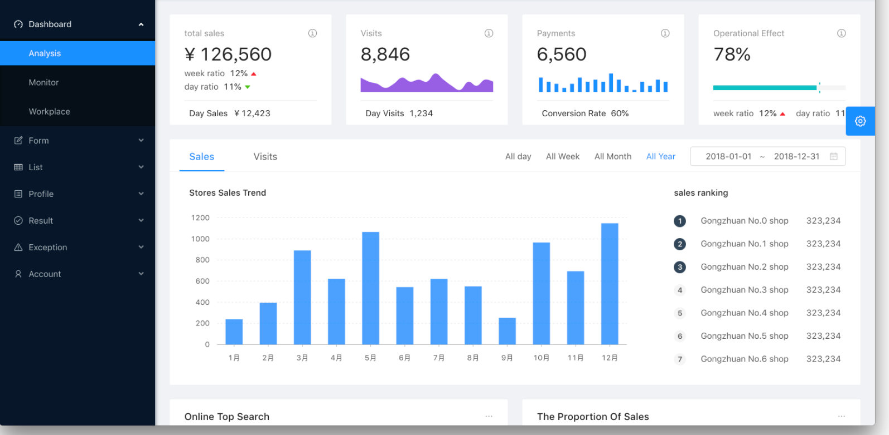

<h1 align="center">React Admin</h1>
<div align="center">


An out-of-box UI solution for enterprise applications as a React boilerplate.





## Features

- :gem: **Neat Design**: Follow [Ant Design specification](http://ant.design/)
- :triangular_ruler: **Common Templates**: Typical templates for enterprise applications
- :rocket: **State of The Art Development**: Newest development stack of React/umi/dva/antd
- :iphone: **Responsive**: Designed for variable screen sizes
- :art: **Theming**: Customizable theme with simple config
- :globe_with_meridians: **International**: Built-in i18n solution
- :gear: **Best Practices**: Solid workflow to make your code healthy
- :1234: **Mock development**: Easy to use mock development solution
- :white_check_mark: **UI Test**: Fly safely with unit and e2e tests

## Templates

```
- Dashboard
  - Analytic
  - Monitor
  - Workspace
- Form
  - Basic Form
  - Step Form
  - Advanced From
- List
  - Standard Table
  - Standard List
  - Card List
  - Search List (Project/Applications/Article)
- Profile
  - Simple Profile
  - Advanced Profile
- Account
  - Account Center
  - Account Settings
- Result
  - Success
  - Failed
- Exception
  - 403
  - 404
  - 500
- User
  - Login
  - Register
  - Register Result
```

## Usage

### Use bash

```bash
$ git clone https://github.com/ant-design/ant-design-pro.git --depth=1
$ cd ant-design-pro
$ npm install
$ npm start         # visit http://localhost:8000
```

## Browsers support

Modern browsers and IE11.

| [](http://godban.github.io/browsers-support-badges/)</br>IE / Edge | [](http://godban.github.io/browsers-support-badges/)</br>Firefox | [](http://godban.github.io/browsers-support-badges/)</br>Chrome | [](http://godban.github.io/browsers-support-badges/)</br>Safari | [](http://godban.github.io/browsers-support-badges/)</br>Opera |
| --------- | --------- | --------- | --------- | --------- |
| IE11, Edge| last 2 versions| last 2 versions| last 2 versions| last 2 versions

## Contributing

